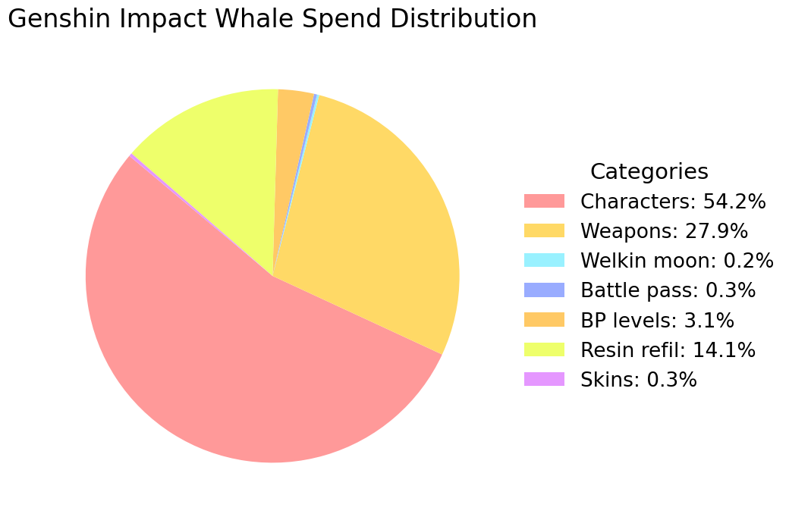

# Genshin Impact - Whale Calculator
This is a calculator that estimates how much a Genshin Impact whale can spend in the game.

## Pie Spend Distribution

## Table Spend Distribution

| Type | Spend (EUR) | Spend (USD) | Share |
| :--- | :--- | :--- | :--- |
|All C6 characters|96699.33|99690.03 | 54.20% |
|All R5 weapons|49756.02|51294.87 | 27.89% |
|Welkin moon|333.98|344.31 | 0.19% |
|Battle pass|474.82|489.51 | 0.27% |
|Battle pass levels|5528.45|5699.43 | 3.10% |
|Daily resin refil|25120.49|25897.41 | 14.08% |
|All Skins|484.95|499.95 | 0.27% |
| |
| **Total** | **178398.04 EUR** |183915.51** USD** | **100%** |

**!!!** 
The result represents a theoretical cost, not an average or realistic outcome.

