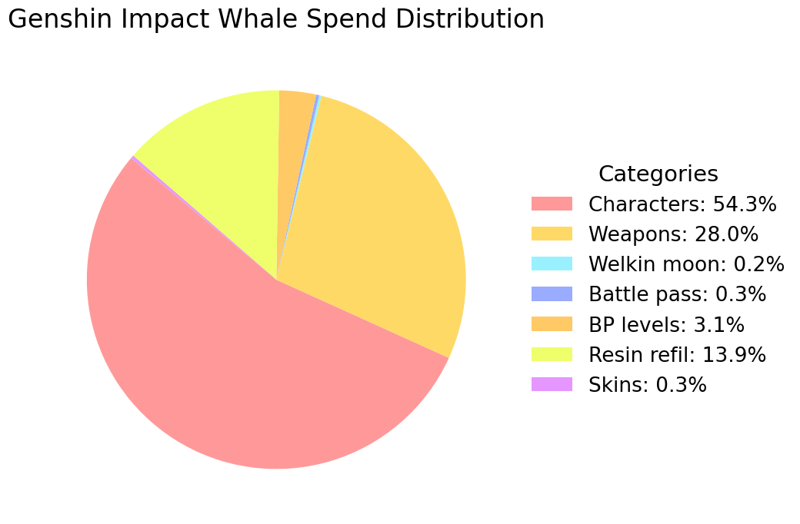

# Genshin Impact - Whale Calculator
This is a calculator that estimates how much a Genshin Impact whale can spend in the game.

## Pie Spend Distribution

## Table Spend Distribution

| Type | Spend (EUR) | Spend (USD) | Share |
| :--- | :--- | :--- | :--- |
|All C6 characters|102906.71|106089.39 | 54.30% |
|All R5 weapons|52956.70|54594.54 | 27.94% |
|Welkin moon|353.34|364.27 | 0.19% |
|Battle pass|503.90|519.48 | 0.27% |
|Battle pass levels|5916.41|6099.39 | 3.12% |
|Daily resin refil|26381.36|27197.28 | 13.92% |
|All Skins|484.95|499.95 | 0.26% |
| |
| **Total** | **189503.37 EUR** |195364.30** USD** | **100%** |

**!!!** 
The result represents a theoretical cost, not an average or realistic outcome.

